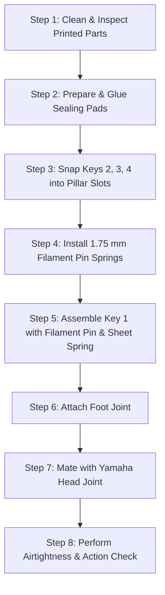

# SoloABec Soprano: Step-by-Step Maker Assembly Tutorial

Welcome to the **SoloABec** maker assembly guide. SoloABec is an open-source, fully acoustic one-handed soprano recorder designed for single-hand playing across a full chromatic compass (C5 to C#7 at A=440 Hz, 26 fingerings in the chart).

This tutorial walks you through everything needed to 3D print and assemble the instrument at home using ordinary desktop 3D printing and everyday household items.

The design requires **zero screws**, **no bought metal springs**, and **zero aftermarket hardware**. The key brackets snap directly into integrated pillar slots on the body, standard 3D printer filament serves as pivot pins and pin springs, and the body mates directly with any standard Yamaha soprano recorder head.

---

## 1. What You 3D Print

All files are provided as plain downloadable STL files:

1. **Acoustic Body (`Body.stl`):** The main body tube containing the toneholes, pillar slots, pin slot, and octave hole.
2. **Foot Joint (`Foot.stl`):** The lower bell section that mates onto the bottom of the body.
3. **Key 1 (`Key_1.stl`):** The thumb octave key mounted in the rear pin slot.
4. **Key 2 (`Key_2.stl`):** The articulated finger key covering Tonehole 4.
5. **Key 3 (`Key_3.stl`):** The articulated finger key covering Tonehole 5.
6. **Key 4 (`Key_4.stl`):** The articulated finger key covering Tonehole 6.
7. **Sheet Spring (`Sheet_Spring.stl`):** The flexible cantilever spring strip that powers Key 1 return action.

*Note on Handedness:* The default STLs are set up for a right-handed player. If building for a left-handed player, simply mirror the body, foot, and keys horizontally along the central bore axis in your slicer software before printing.

---

## 2. What You Need from Home (Parts and Materials)

You do not need to order specialized musical instrument hardware or metal fasteners. Everything assembles from parts you can find around the house or workshop:

* **Any Yamaha Soprano Recorder Head:** The printed body is engineered to mate directly with any Yamaha soprano recorder head on the market. Using a commercial head ensures immediate, reliable acoustic tone production and certified food-safe oral contact.
* **1.75 mm 3D Printer Filament:** A few short snippets of ordinary 1.75 mm PLA or PETG filament (about 20 to 25 mm each). These serve two functions:
  * A straight snippet acts as the pivot pin for Key 1.
  * Snippets act as flexible pin springs for Keys 2, 3, and 4.
* **Sealing Pads:** Small discs (approximately 9.5 mm and 11.0 mm in diameter, 2 to 3 mm thick) to seal the toneholes. You can use craft foam, adhesive neoprene, leather pads, or any sealing disc material that creates an airtight seal.
* **Household Adhesive:** A drop of cyanoacrylate (superglue) or craft adhesive to glue the pads into the key pad cups.
* **Tenon Seal:** Paper tape, thread, O-ring, or cork (all work fine) to ensure an airtight friction fit when connecting the printed body to your Yamaha head joint and foot joint.
* **Hand Tools:** A small craft knife, hobby file, or fine sandpaper to clean up support marks and make sure hole rims are smooth.

*Note on Fasteners:* The assembly mechanism operates entirely by snapping key brackets directly into pillar slots, requiring no screws. We considered using common screws, and if community feedback suggests that screws provide greater strength, we can evaluate a screw-compatible version in the future. However, the current design is completely self-contained and screw-free.

---

## 3. Slicer Recommendations

Because every 3D printer, nozzle, and filament brand behaves differently, these recommendations provide a proven starting baseline rather than a rigid rule:

* **Print Orientation:**
  * **Body and Foot Joint:** Print vertically upright along the bore axis, with the joint tenon on the build plate. Use a brim for bed adhesion. Never print the acoustic body horizontally, as horizontal layer lines cause bore distortion and air leakage.
  * **Tonehole Overhangs:** The acoustic geometry was calculated and optimized using Inria Openwind, featuring compensatory additional openings designed to keep toneholes fully rounded while respecting 3D printing overhang angles without internal supports.
  * **Keys:** Print horizontally or tilted using standard slicer support structures.
* **Perimeters and Walls:** Use 4 to 6 solid wall perimeters. Acoustic instruments require dense, non-porous walls so sound waves reflect cleanly without leaking air through layer boundaries.
* **Infill:** Use 100% solid infill on the keys and tonehole mounts for mechanical rigidity; 30% to 50% infill is suitable for the outer body bulk.
* **Layer Height:** 0.12 mm to 0.16 mm produces smooth bearing surfaces in pillar slots and clean sealing rims on toneholes.
* **Material Selection:** Standard PLA, PETG, or ABS work reliably.
* **Resin Printing Advisory:**
  * Do **NOT** use consumer-grade, non-medical or non-dental photopolymer resins due to contact and toxicity hazards.
  * Even when using certified dental resins, **avoid printing the acoustic body in resin**. UV light cannot cure the long, narrow internal bore evenly. The post-curing process creates bore warping and chemical inconsistencies that ruin acoustic intonation.
  * Keys can be printed in tough engineering resin if desired, but standard FDM printing with supports produces durable and impact-resistant parts.

---

## 4. Step-by-Step Physical Assembly

Follow these steps in chronological order:

### Step 1: Clean and Inspect Printed Parts
1. Remove all slicer support material from Keys 1 to 4.
2. Check the internal bore of the body and foot joint. Clear away any stray strings or loose filament bits so the air column is completely unobstructed.
3. Inspect each tone hole rim (the flat raised lip around each hole). Ensure the rims are clean, flat, and free of burrs or pimples. Lightly touch them with fine sandpaper if needed to ensure a perfectly flat sealing surface.

### Step 2: Prepare and Glue Sealing Pads
1. Cut circular pads from your chosen pad material (craft foam, adhesive neoprene, or leather).
2. Check that the pads fit neatly inside the pad cups on Keys 2, 3, and 4.
3. Place a small drop of superglue or craft adhesive into each pad cup.
4. Press the pad firmly into the cup, making sure it sits flat and level without tilting. Let the glue cure fully before mounting the keys.

### Step 3: Snap Keys 2, 3, and 4 into Pillar Slots
1. Take Key 2 and identify its corresponding pair of pillar slots on the body.
2. Align the bracket of Key 2 with the open slots in the body pillars.
3. Gently press the bracket down into the pillar slots until it snaps securely into place.
4. Repeat for Key 3 and Key 4.
5. Test each key: it should turn smoothly on its pivot axis without binding or excessive wobble.

### Step 4: Install 1.75 mm Filament Pin Springs
1. Cut three straight snippets of standard 1.75 mm printer filament, each approximately 20 to 25 mm long.
2. For each key (Keys 2, 3, and 4), insert one end of the filament snippet into the small anchor hole located in the lower pillar base.
3. Flex the free end of the filament snippet slightly and tuck it under the spring hook on the underside of the key shaft.
4. The natural elasticity of the polymer filament acts as a pin spring, pressing the key pad cup firmly closed over the tone hole rim.
5. Press each touchpiece with your finger: the pad should lift smoothly, and when you release your finger, the pin spring should snap the pad shut instantly.

### Step 5: Assemble Key 1 (Thumb Octave Key)
1. Position Key 1 into the pin slot on the back of the body tube.
2. Cut a straight snippet of 1.75 mm filament to the width of the pin slot (approximately 12 to 14 mm).
3. Slide this filament snippet through the pin slot holes and through Key 1, creating a clean pivot pin. Trim any excess flush with the pin slot walls.
4. Slide the 3D-printed flexible sheet spring into the spring bed directly behind the pin slot. The cantilever spring arm presses against the back of Key 1, keeping the octave hole closed at rest until your thumb presses the touchpiece to open it.

### Step 6: Attach the Foot Joint
1. Align the bottom tenon of the main body with the socket of the foot joint.
2. Apply paper tape, thread, an O-ring, or cork around the tenon (all work fine) to establish an airtight friction fit.
3. Press the foot joint firmly onto the body until the shoulder seats flush against the body stop.

### Step 7: Mate with the Yamaha Head Joint
1. Apply paper tape, thread, an O-ring, or cork around the top tenon of the printed body (all work fine).
2. Push the body firmly into your Yamaha soprano recorder head joint.
3. Visually align the front toneholes with the labium window on the head joint so the instrument is straight.

### Step 8: Perform Airtightness and Playability Checks
1. Gently blow warm air through the recorder while keeping all toneholes closed.
2. Listen and feel for air leaks around the pad cups. If a pad is not sealing completely, check that the pad is sitting flat in its cup and that the pin spring provides enough closing force.
3. Test finger action: press each touchpiece to ensure full, unobstructed travel and snappy spring return.

---

## 5. Playing and Digital Pedagogy

SoloABec inverts the traditional woodwind layout: the player's single functional hand covers toneholes directly with their fingers, while the articulated keys open holes 2 to 4 (with the octave hole as hole 1). Lower toneholes (holes 4 to 8) are closed directly by fingers. Because different key configurations are planned for future variants, the design and software remain adaptable.

To make learning easy for teachers and students, the project includes an open-source **Interactive Fingering Viewer**:

* **Web Viewer (`fingering_viewer.html`):** Open this file in any web browser to see dynamic finger placement diagrams and musical staff notation for all 26 chromatic fingerings from C5 to C#7.
* **Fingering Data (`fingering_soprano.csv`):** All fingering combinations are stored in an open CSV file, allowing educators to modify or extend fingering charts for specific student ergonomic needs.
* **Classroom Integration:** The visual diagrams allow elementary music teachers to guide single-handed learners using the same curriculum and songs as the rest of the class.

---

## 6. Community Support, References, and Disclaimers

### Community Support in Initial Stages
During these early stages of project release, we welcome educators, makers, and families reaching out to us. If you encounter any challenges with printer tolerances, assembly fit, or player ergonomics, please contact us so we can help troubleshoot and incorporate your feedback into ongoing refinements.

### References and Disclaimers
* **Acoustic Optimization:** Inria Openwind (open-source wind instrument design toolbox).
* **Prior Art Reference:** ArtefactosLAB, University of Alicante. (2021). *Flow: A Socially Responsible 3D Printed One-Handed Recorder*. MDPI IJERPH. SoloABec was created independently with distinct acoustic geometry, mechanical architecture, and fabrication principles.
* **AI Assistance Disclaimer:** Generative AI tools were utilized to assist with documentation drafting, workflow organization, and software scripting during project development. All CAD models, acoustic designs, and physical prototypes were independently created, verified, and directed by the human author.
* **Licensing:** Distributed under the **Creative Commons Attribution-NonCommercial 4.0 International License (CC BY-NC 4.0)**. Free for personal, educational, and research use. Commercial production or sale is prohibited.
